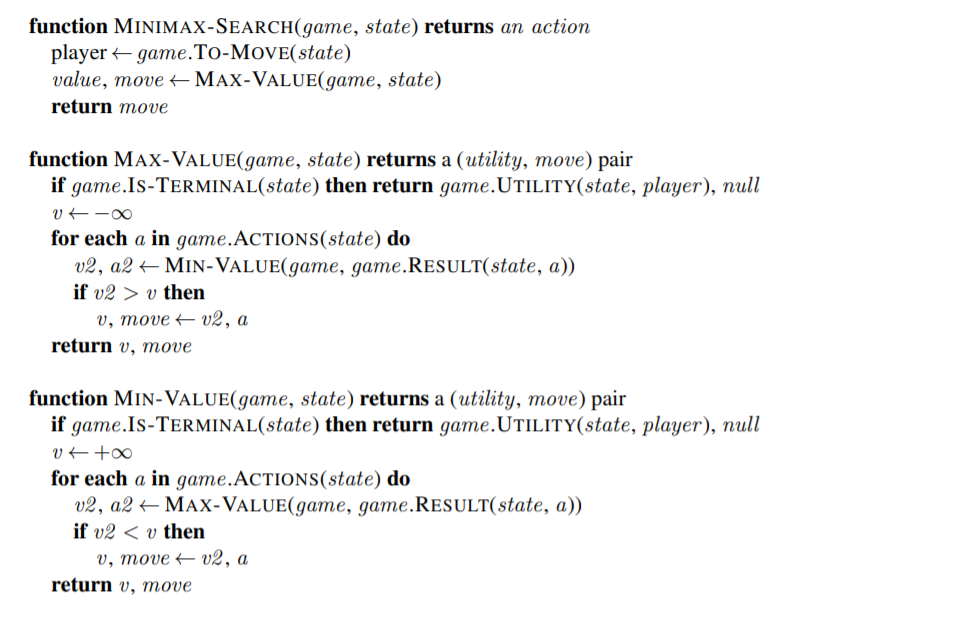

# TicTacToe_minimax_depth_search
Minimax depth search algorithm implemented for optimal moves in TicTacToe game

This algorithm is a python implementation of the minimax algorithm in a tictactoe game, using numpy tools.
The original pseudocode algorithm extracted from *Russel S, Norvig P. Artificial Intelligence: A Modern Approach* follows bellow:  



The program logics, is to made a recursive search - in depth - to look at every possibility and choose the best move - max utility. It works making the assumption that the oponent plays the best as possible - choose the best move for him -, so, against an optimal oponent, the algorithm has optimal performance, and against and oponent error, the algorithm lead to a certain victory.  

Having any experience with tictactoe, you know that every game can end up in a tie, so, the algorithm **never loses**, and if the oponent do a single mistake, the algorithm **will win with a hundred percent sure**, yes, it's unbeatable.  

An important detail is that there are a lot of moves with the same utility, so choosing always the same, makes the game boring and predictable. Based on that, it's very important to randomly chose a move between those with the same utilily.  


An output of the code, specifying the initial state as totally clear, can be seen bellow:

````
[[0 0 1]  
 [0 0 0]  
 [0 0 0]]  

 549945 states visited  

 38.18406 seconds to execute  
 ````

So, the full game has 549945 nodes to look and execute its choice in almost 40 seconds - at least in my machine.  
Must be noticed that when the machine move is the second, the algorithm must look just approximately 549945/9 nodes, leading to an almost 5 seconds execution on my machine, and when the board has at least two marked positions, the execution happens in less than a second, *and that's the ideal response* for a dinamic game.  

This problem can be solved by introducing knowledge about the two first moves, and how to deal with them without proceed with the entire search. I didn't implement this cause this code is just for educational purpose, but the full code implementing an mobile app does that.
